# Roblox Weapons Pack

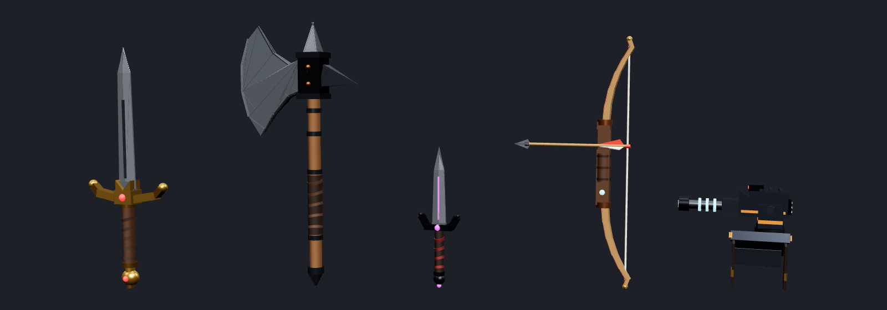

Rigged, scripted weapons for Roblox, plus a flying [enemy drone](#enemy-sentry-drone). The five weapons:

- Longsword
- Battle Axe
- Twin Daggers
- Longbow with arrows and a quiver
- Shoulder Blaster

They're built from ordinary parts, so there are no meshes to upload. They work with R15 and R6 characters, on PC, mobile and gamepad. Each weapon is a single `Tool`, so you can drop it into `StarterPack` and play.

| | Weapon | Primary (click / tap / R2) | Secondary (Q / right-click / L2 / on-screen button) |
|---|---|---|---|
| 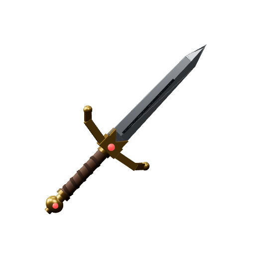 | **Longsword** | Slash, slash, then a forward lunge (3-hit combo) | Hold to **block**: 70% less damage from the front, slower movement |
| 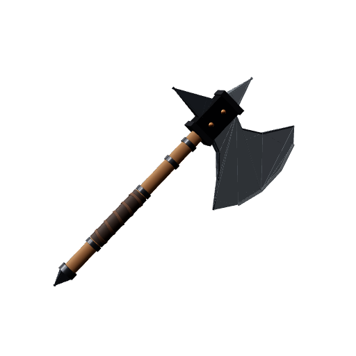 | **Battle Axe** | Slow, heavy overhead **chop** | **Whirlwind**: two spins that hit everyone around you (7 s cooldown) |
| 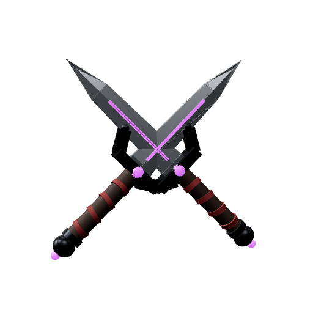 | **Twin Daggers** | Fast stabs, alternating hands. **x2 damage from behind** | **Throw** the off-hand dagger. It sticks in its target and comes back after 3 s |
| 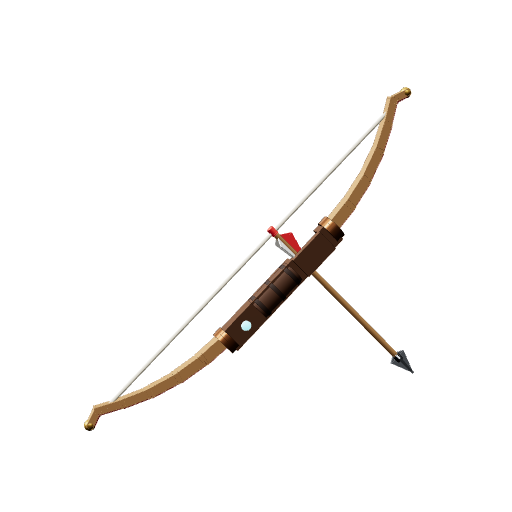 | **Longbow** | Hold to **draw**, release to fire. Longer draws fly faster and hit harder. Headshots do x1.5 | Hold to **zoom** |
| 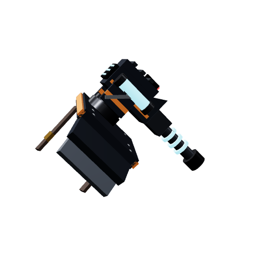 | **Shoulder Blaster** | Hold for **rapid-fire** energy bolts. The turret tracks your aim | Hold to **charge**, then release for an explosive shot (area damage) |

## Install

1. Download [`dist/WeaponsPack.rbxm`](dist/WeaponsPack.rbxm), or a single weapon from [`dist/`](dist).
2. In Roblox Studio, right-click **StarterPack**, choose **Insert from File...** and pick the file. You can also drag the file into the viewport and then move it.
3. If you used the pack, move the Tools you want out of the `WeaponsPack` folder into **StarterPack**. The `WeaponRigger` module can go in **ServerStorage**.
4. Press **Play**.

Each Tool is self-contained: it has its models, its scripts, its own copy of the shared `WeaponCore` module and its own RemoteEvent. No other setup is needed.

## Tuning

Select a Tool and scroll to **Attributes** in the Properties window. Everything is adjustable there without touching code:

| Weapon | Attributes |
|---|---|
| Longsword | `Damage` `LungeDamage` `Cooldown` `ComboWindow` `Range` `BlockReduction` `BlockWalkSpeed` |
| Battle Axe | `Damage` `Cooldown` `Range` `WhirlwindDamage` `WhirlwindRadius` `WhirlwindCooldown` |
| Twin Daggers | `Damage` `Cooldown` `Range` `BackstabMultiplier` `ThrowDamage` `ThrowSpeed` `ThrowCooldown` |
| Longbow | `MinDamage` `MaxDamage` `DrawTime` `MinSpeed` `MaxSpeed` `Cooldown` `ArrowLifetime` `ZoomFOV` `DrawWalkSpeed` `ScriptedDraw` |
| Shoulder Blaster | `Damage` `FireRate` `BoltSpeed` `Range` `ChargeTime` `ChargedDamage` `ChargedRadius` `ChargedCooldown` `TurnSpeed` `YawLeft` `YawRight` `PitchUp` `PitchDown` |
| All | `FriendlyFire` (hit teammates), `ShowHolstered` (show the weapon on the body while unequipped), `Anim...` (your animations, see below) |

## Rigging

Every weapon is rigged with **Motor6Ds**, the same joint type Roblox characters use. That means the Animation Editor can keyframe the weapon itself, not only the arm holding it.

```
Tool
├─ Handle          invisible grip anchor (the engine welds it to the hand)
├─ <Model>         the visible weapon, PrimaryPart = BodyAttach
│   ├─ BodyAttach  rig root: joined to the hand by Motor6D "WeaponJoint_<Model>"
│   └─ parts...    welded to BodyAttach, or to a sub-root for moving parts
├─ WeaponCore      shared ModuleScript (Rig, Combat, Projectile, Effects, Server, Client)
├─ Server          Script
├─ Client          LocalScript
└─ Remote          RemoteEvent
```

| Weapon | Joints you can animate | Where it attaches |
|---|---|---|
| Longsword | `BodyAttach` | right hand. Worn across the back, hilt over the right shoulder |
| Battle Axe | `BodyAttach` | right hand. Worn across the back, head over the left shoulder |
| Twin Daggers | `BodyAttach` (right), `OffhandAttach` (left) | both hands. Worn crossed at the small of the back |
| Longbow | `BodyAttach` (riser), `UpperLimb`, `LowerLimb`, `Nock` (string), `QuiverAttach` | right hand. Bow worn on the back, quiver on the right hip |
| Shoulder Blaster | `BodyAttach` (pauldron), `YawBase` (turn), `Cannon` (tilt), `Barrel` (recoil) | `UpperTorso` at `RightCollarAttachment` |

A few details:

- **Where things attach** is stored in attributes on each model's root part: `RigLimb`, `RigAttachment`, `RigOffset` while equipped, and `HolsterLimb`, `HolsterAttachment`, `HolsterOffset` while holstered. The offsets are CFrames, so you can edit them in Properties to move a grip or a holster spot. Limb names are R15, and R6 equivalents are used automatically.
- **Bow string**: two Beams run between attachments on the limb tips and the `Nock`. The string bends by itself when `Nock` moves back and the limbs flex. The nocked `Arrow` is welded to `Nock`, and the flying arrow is a copy of it.
- **Rest poses**: each built-in joint stores its rest position in a `RestC0` attribute. Script poses are applied on top of it (`C0 = RestC0 * pose`). The bow limbs and nock also store their full-draw pose in `PoseDrawn`.
- **Moving parts are joined correctly.** Parts that move (limbs, nock, turret, barrel) are joined only by their Motor6D, never also welded. Everything else is welded to its root with WeldConstraints. All parts are `Massless` and non-colliding, so they don't affect character physics.

## Animating your weapons

The weapons work immediately with Roblox's built-in tool animations, plus scripted weapon poses such as the axe windup, the sword block, the bow draw and the blaster recoil. To use your own animations:

1. Insert a rig with **Avatar > Rig Builder** (R15 or R6).
2. Put `WeaponRigger` in ServerStorage and run this in the Command Bar:
   ```lua
   require(game.ServerStorage.WeaponRigger).rig(workspace.Rig, game.StarterPack.Longsword)
   ```
   This attaches the weapon with the same joints it uses in game.
3. Open the **Animation Editor** on the rig. The weapon joints (`BodyAttach`, `Nock`, `YawBase`, ...) appear as tracks you can keyframe.
4. Publish the animation, then paste its ID into the matching attribute on the Tool, for example `AnimSlash1 = rbxassetid://1234567890`. A bare number also works.

| Weapon | Animation attributes |
|---|---|
| Longsword | `AnimIdle` `AnimSlash1` `AnimSlash2` `AnimLunge` `AnimBlock` (looped) |
| Battle Axe | `AnimIdle` `AnimChop` `AnimWhirlwind` |
| Twin Daggers | `AnimIdle` `AnimStabRight` `AnimStabLeft` `AnimThrow` |
| Longbow | `AnimIdle` `AnimDraw` `AnimRelease` |
| Shoulder Blaster | `AnimEquip` |

When an `Anim...` attribute is set, that animation replaces the built-in fallback for that move. Animations played this way replicate to every player automatically. The bow's string and limbs are always script-driven; if you keyframe them yourself, set `ScriptedDraw = false`.

## Hooking into your game

- **Kill credit**: damage leaves a standard `creator` ObjectValue on the victim's Humanoid, so classic leaderboard and KO scripts work unchanged.
- **Teams**: teammates can't hurt each other unless `FriendlyFire` is on. Neutral players can hit anyone.
- **Blocking**: any character with the attribute `Blocking = true` takes `(1 - BlockReduction)` damage from frontal hits by any weapon in this pack. Your own abilities can set it too.
- **NPCs**: anything with a Humanoid can be hit.
- **Projectiles** fly in `workspace.WeaponProjectiles`. They're simulated on the server with real physics and checked with raycasts every frame, so fast shots don't pass through targets.
- **Security**: the server owns hit detection, damage, cooldowns and range checks. Clients only send input.

## Icons and sounds

- `icons/*.png` are transparent 512×512 hotbar icons. Upload them (Creator Hub or Studio's Asset Manager), then set each Tool's `TextureId` to the image ID.
- The sounds use Roblox's built-in `rbxasset://sounds/...` files so they work with no uploads. They're placeholders: swap the `SoundId` on the Sound objects (inside `Handle`, or `BodyAttach` for the blaster) for anything from the Creator Store.

## Enemy: Sentry Drone

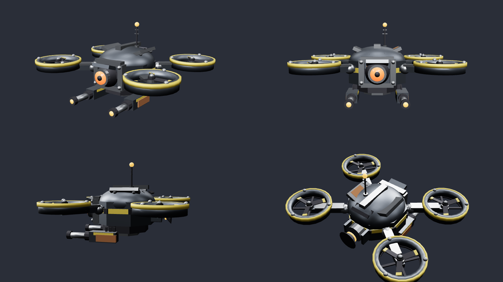

A small flying robot enemy, made in the same palette and style as the rest of your enemy set (gunmetal, steel, hazard yellow, rust, hot orange eye). It's an armored quadcopter with ducted fans, a turret eye and twin under-slung blasters. It's about 2.3 units across, 9.7k triangles, and faces +Z like the others.

**[`dist/SentryDrone.glb`](dist/SentryDrone.glb)** is one skinned mesh with a full skeleton and five animations:

| Bones | Animations |
|---|---|
| `root` > `body` > `head` (eye turret), `antenna`, `rotor_FL` `rotor_FR` `rotor_BL` `rotor_BR`, `gun_L` > `muzzle_L`, `gun_R` > `muzzle_R`, `thruster` | `idle` (hover bob, look around), `fly` (nose-down cruise), `attack` (alternating gun recoil), `hit` (jolt), `death` (sparks out and tumbles down). The rotors spin in every clip. |

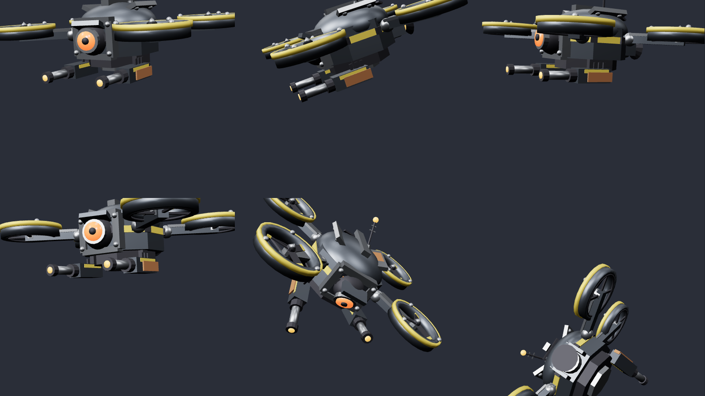

### Making it an enemy in Roblox

1. **Import:** Studio > **Avatar > Import 3D** (or File > Import 3D), and pick `SentryDrone.glb`.
2. **Add the brain:** insert [`dist/DroneAI.rbxm`](dist/DroneAI.rbxm) (a Script) into the imported drone Model, then put the Model in Workspace where it should patrol.
3. **Play.** The drone patrols around its spawn point. When it sees a player it circles them at range and fires volleys of leading shots, with its eye flaring before each one. When it dies it explodes, tumbles out of the sky and respawns.

The script handles setup itself:
- it welds the parts together and adds a Humanoid for health, plus a health bar
- it finds the `muzzle` bones to shoot from
- it works out which way the model faces from its `head` bone, so an import that faces backwards still aims correctly

The weapons pack damages it normally.

**Tuning** (attributes on the drone Model, created on first run): `MaxHealth` `Speed` `HoverHeight` `PatrolRadius` `AggroRange` `AttackRange` `PreferredRange` `FireRate` `Burst` `BurstCooldown` `Damage` `BoltSpeed` `Spread` `LeadTargets` `Respawn` `RespawnTime` `ShowHealthBar`.

**Animations:** the clips come in with the import. Publish each one from the Animation Editor, then paste the IDs into `AnimIdle`, `AnimFly`, `AnimAttack`, `AnimHit` and `AnimDeath` on the Model. Until then the drone still bobs, banks into turns and tilts under fire procedurally, but the rotors only spin once the animations are set.

**Resizing:** `python src/meshes/sentry_drone.py --scale 0.8` rebuilds it smaller or bigger, with the skeleton and animations scaled to match. It needs `pip install -r src/meshes/requirements.txt`.

## Enemy models: refined

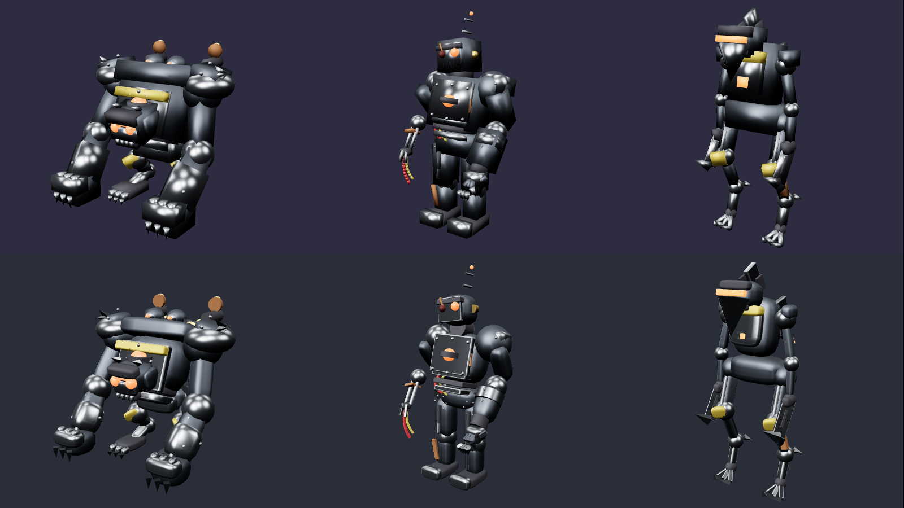

Smoothed-out versions of your gorilla boss, zombie clanker and speeder are in [`dist/enemies/`](dist/enemies). They have the same bones, skin binding, animations and materials as the files you gave me (checked byte for byte), so they drop in as replacements. Only the geometry is new:

- **Chunky blocks** (torsos, limbs, heads, fists, feet) are rebuilt as rounded superellipsoid "pillow" shapes. Each keeps the original size and position but loses the box outline.
- **Thin plates** (armor, trims, the chest hatch) stay crisp but get rounded edges, so they still read as armor.
- **Cylinders** go from 8 to 16 sides, and **spheres** get perfectly smooth shading. The blotchy chrome look came from the old boxes sharing smoothed normals.
- **Triangle budget:** each model stays under 19,000 triangles, inside Roblox's roughly 20k-per-mesh import limit. The biggest pieces get the smoothest shapes, and tiny rivets use fewer triangles.

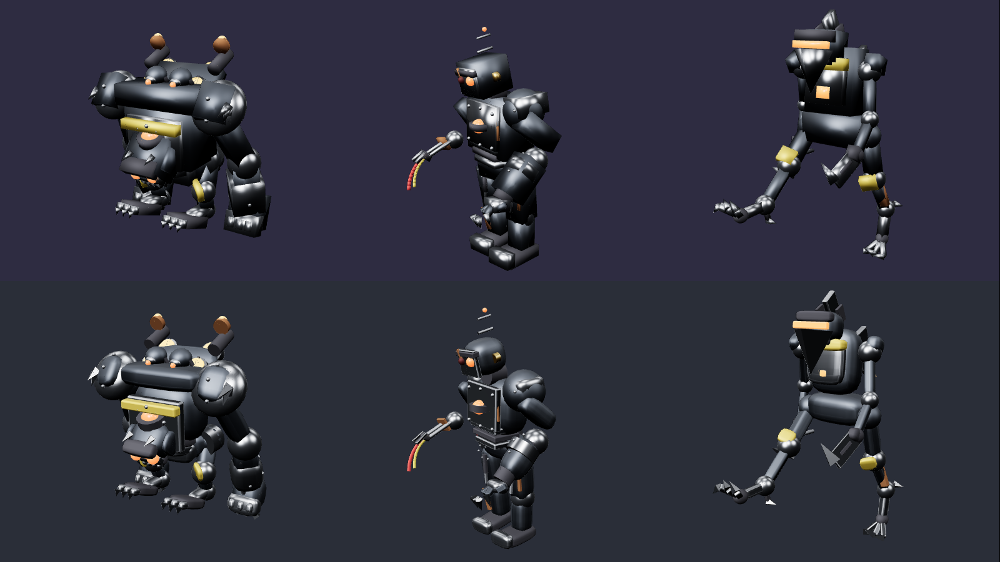

To re-run it on new or updated models, put the `.glb` files in `src/meshes/source/` and run `python src/meshes/refine_models.py`. Use `--budget 15000` for lighter meshes. You can also point it at one file: `python src/meshes/refine_models.py model.glb -o out.glb`.

## Building from source

The models are generated by code, so they're easy to tweak and rebuild. You need [Lune](https://github.com/lune-org/lune); the pinned version is in `rokit.toml`.

```sh
lune run src/build.luau            # writes dist/*.rbxm
lune run tools/verify.luau         # loads the built files back and checks them
tools/check.sh                     # build + type-check scripts against the Roblox API (needs luau-lsp)
lune run src/build.luau --preview  # then: cd tools/preview && npm i && node render.mjs
```

```
src/
  build.luau             entry point
  builder/Parts.luau     geometry helpers: wedge triangles, tapered blades, polygon plates, struts...
  builder/ToolKit.luau   Tool assembly, rig/holster attributes, script embedding, validation
  models/*.luau          one file per weapon (geometry + rig + tuning defaults)
  runtime/WeaponCore/    shared in-game modules
  runtime/weapons/       per-weapon Server / Client scripts
  runtime/WeaponRigger.luau
  runtime/enemies/       DroneAI script
  meshes/                Python mesh tools: sentry_drone.py (generator), refine_models.py (de-boxer)
  meshes/source/         original rigged enemy GLBs the refiner reads
tools/                   checks, verification, preview renderer
dist/                    built .rbxm / .glb files (ready to insert or import)
docs/previews/           renders of each weapon: alone, held, holstered
icons/                   hotbar icons
```

<details>
<summary>Preview renders</summary>

Each image shows the weapon from three angles (for the bow and blaster, the third view is posed: drawn or recoiled), held on a stand-in R15 character, and holstered.

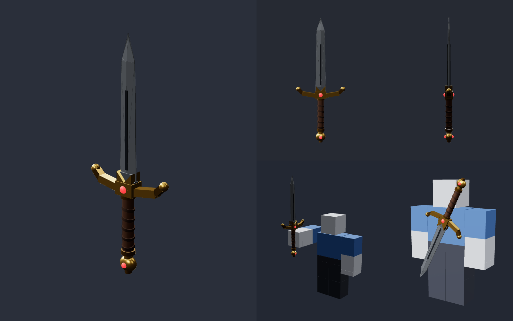
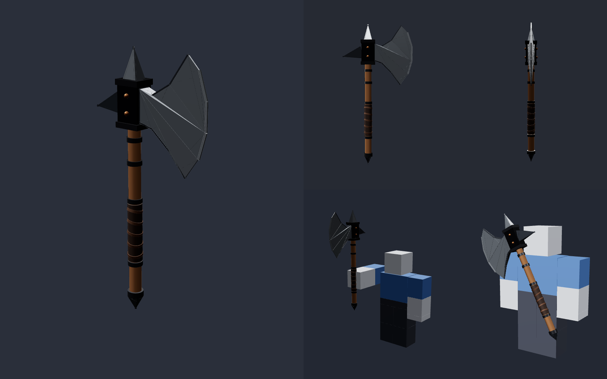
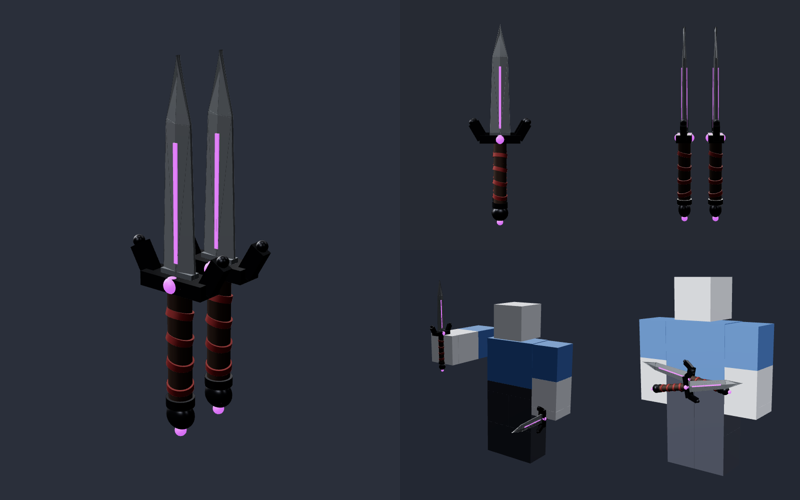
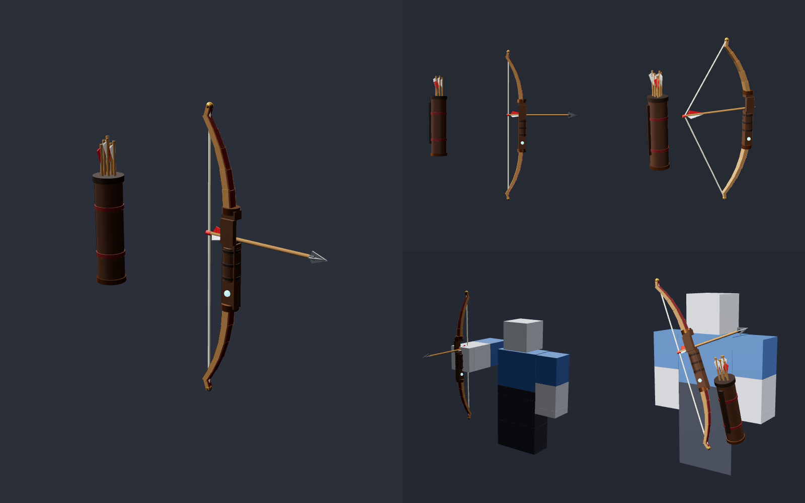
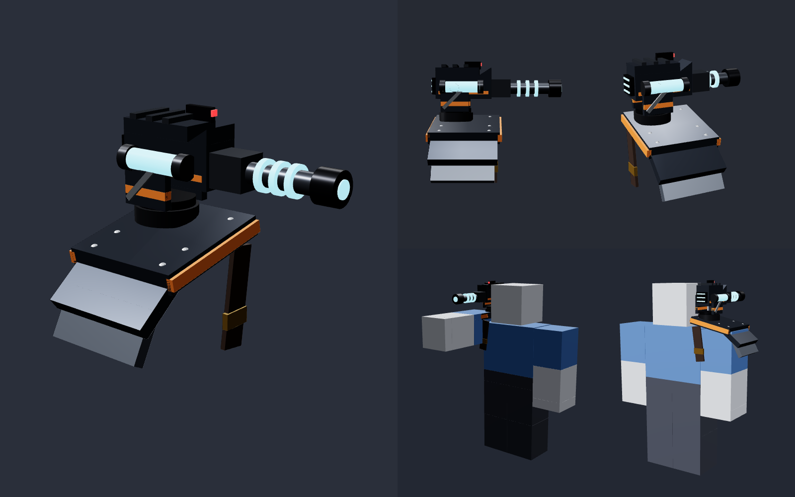

</details>
